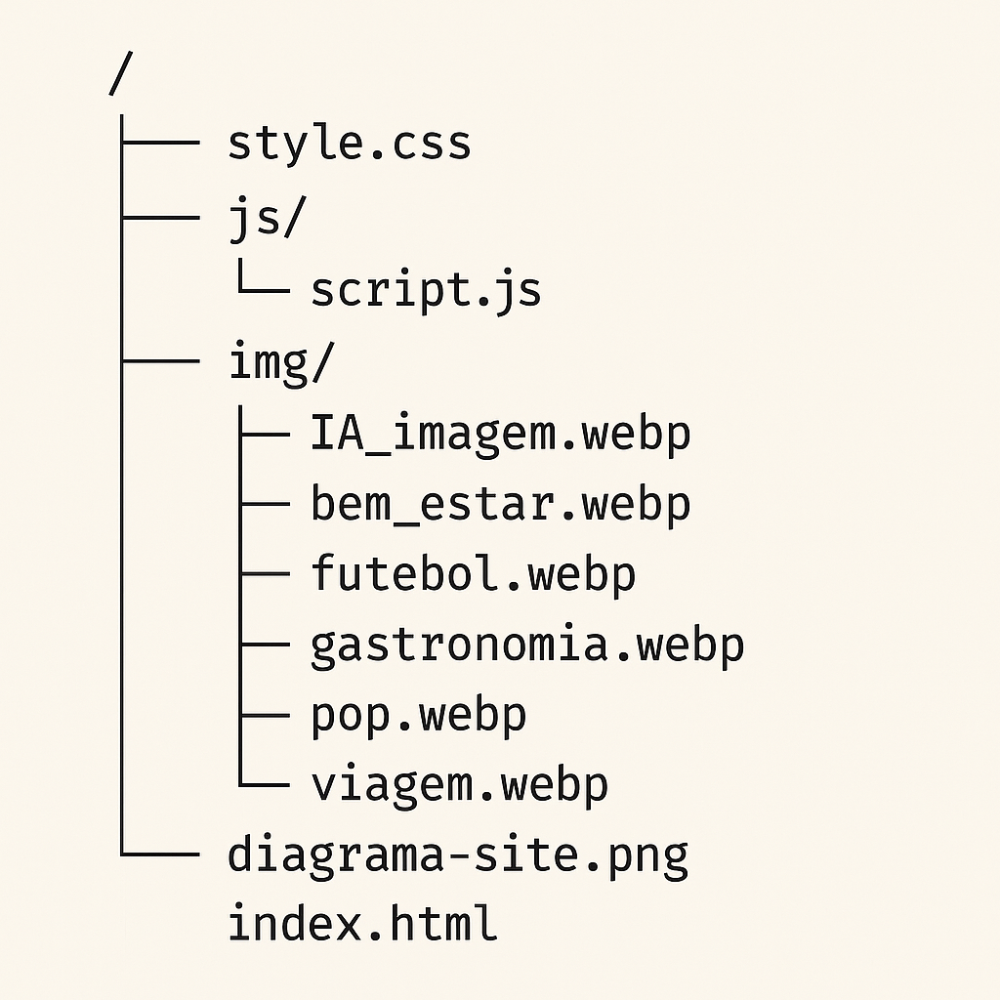

<div align="center">
  
</div>

# 🚀 Blog do Cláudio - Um Projeto Front-End Completo

<p align="center">
  
  
  
  
  
</p>

> Projeto de um blog de variedades moderno e interativo, desenvolvido com as tecnologias fundamentais do front-end. O site apresenta um design totalmente responsivo, funcionalidades dinâmicas implementadas com JavaScript puro e uma experiência de navegação única com rolagem "infinita".

<div align="center">
  <sub>Criado por <a href="https://www.linkedin.com/in/roquenobre/">Cláudio Roque</a></sub>
</div>

---

## 🏗️ Arquitetura do Site

A estrutura do site foi planejada para ser simples e intuitiva, conectando quatro páginas principais e um relatório técnico, oferecendo uma navegação fluida.

### 🔗 Fluxo entre as páginas:

<div align="center">
  
</div>

---

## 📂 Estrutura de Ficheiros

```plaintext
/
├── css/
│   └── style.css
├── js/
│   └── script.js
├── img/
│   ├── IA_imagem.webp
│   ├── bem_estar.webp
│   ├── futebol.webp
│   ├── gastronomia.webp
│   ├── pop.webp
│   ├── viagem.webp
│   └── diagrama-site.png
├── index.html
├── artigos.html
├── sobre.html
├── contato.html
└── relatorio.html
```

## ▶️ Veja funcionando

👉 Acesse o projeto em:  
https://roque100.github.io/Blog-Responsivo

## ⚖️ Licença

Este projeto está sob a licença MIT. Veja o arquivo [LICENSE](./LICENSE) para mais informações.
